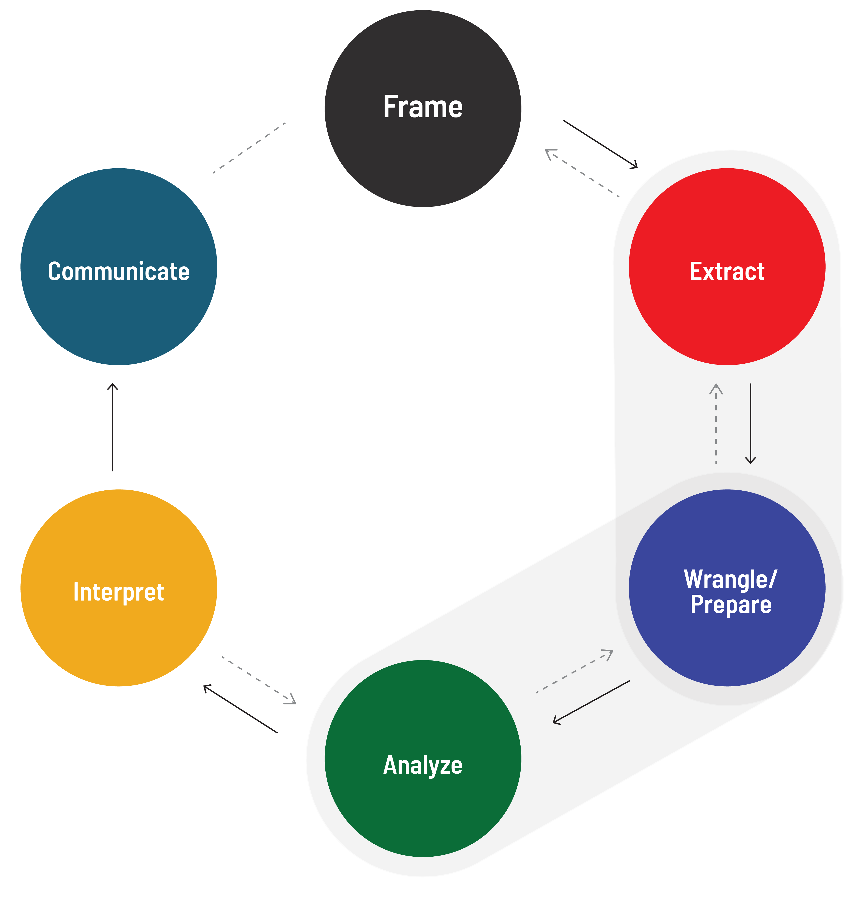

<h1>
  Exploratory Data Analysis With Pandas
  Intro to Data Analytics
</h1>

**Learning objective:** By the end of this lesson, students will be able to understand the application of python in extracting and preparing data for analysis.

| Lesson                  | Duration |
| ----------------------- | -------- |
| Intro to Data Analytics | 5 min    |

## Our Learning Goals

- Use Pandas to read in a data set.
- Use DataFrame attributes and methods to investigate a data set’s integrity.
- Apply filters and sorting to DataFrames.

## The Data Analytics Workflow

- **Extract:** Select and import relevant data.
- **Wrangle/Prepare:** Clean and prepare relevant data.
- **Analyze:** Structure, comprehend, and visualize data.

